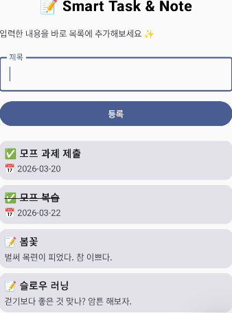

# 04주차 1차시 ==> 03주차 내용 실습

이번주 수업은 **Jetpack Compose의 기본 UI 구성과 상태(State) 사용**에 익숙해지는 것이 목표입니다.

수업은 Compose 소개, 기본 구조, Layout(Column / Row / Box), Modifier, Preview, Text, Card, TextField, State, Button 내용을 바탕으로 실습을 진행합니다.

---

## 1. 수업 목표

이번주 수업을 마치면 다음을 할 수 있어야 합니다.

- `@Composable` 함수로 화면을 구성할 수 있다.
- `Column`, `Row`, `Box`를 이용해 UI를 배치할 수 있다.
- `Modifier`로 크기, 여백, 배경 등을 조절할 수 있다.
- `Text`와 스타일을 사용해 제목/설명 문구를 구성할 수 있다.
- `Card`를 사용해 입력 영역과 미리보기 영역을 나눌 수 있다.
- `OutlinedTextField`, `Checkbox`, `Button`을 사용할 수 있다.
- `remember { mutableStateOf(...) }`를 사용해 상태를 선언하고, 상태 변화에 따라 UI가 바뀌는 것을 확인할 수 있다.
- `@Preview`를 이용해 에뮬레이터 없이 화면을 확인할 수 있다.

---

## 2. 실습 주제

이번 주에는 **간단한 Task 입력 화면**을 만들어 봅니다.

최종적으로 아래와 같은 화면이 나오면 됩니다.

---

이번 주 핵심은 **Compose에서 UI는 상태의 결과물이며, 상태가 바뀌면 화면도 바뀐다**는 점을 직접 확인하는 것입니다.
