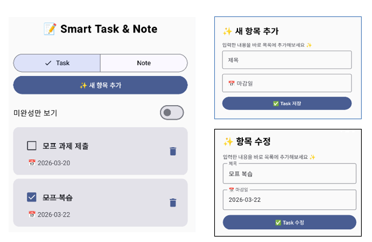
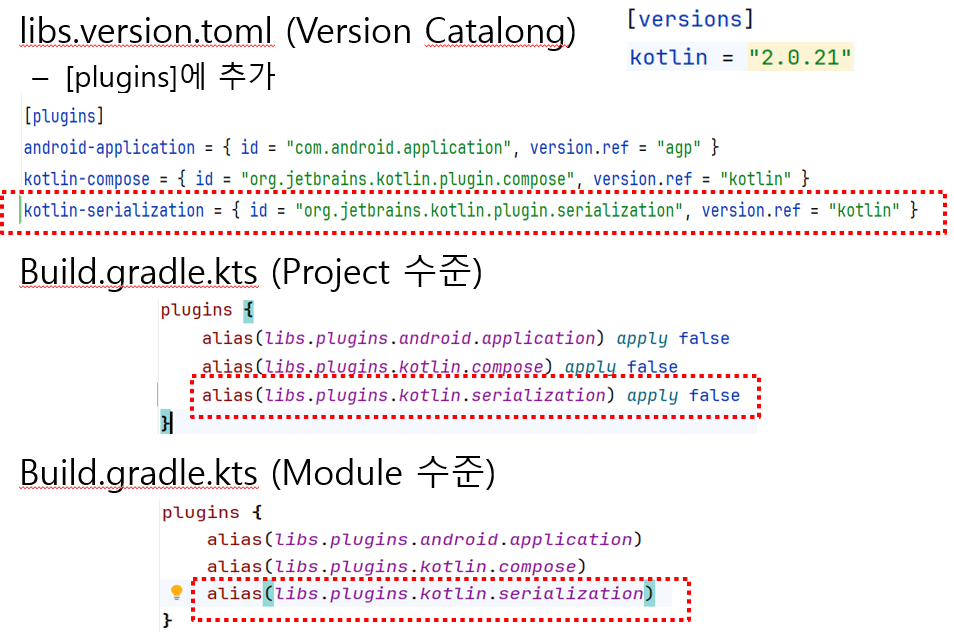

# 📑 06주차: Navigation & ViewModel 

이번주 수업은 **화면 전환 및 화면 간 데이터 전달**에 익숙해 지는 것이 목표입니다. 

---

## 1. 수업 목표
1. **Type-safe Navigation**: `@Serializable` 객체를 이용한 안전한 경로 정의 및 인자(Argument) 전달.
2. **Shared ViewModel**: `NavBackStackEntry`를 활용하여 여러 화면이 하나의 ViewModel 인스턴스를 공유하는 전략.
3. **Back Stack Management**: `popUpTo`와 `inclusive` 속성을 이용한 앱 흐름 제어 및 스택 정리.

---

## 2. 실습 주제

기존에 만들어온 Smart Task&Notes 앱에 화면을 추가하여 화면 전환하는 작업을 수행합니다.

1. 앱에서 추가화면을 만들어 화면 전환하기
2. 나열된 항목 클릭하여 수정하기

---

## 라이브러리 & 플러그인 설정 가이드

1. 라이브러리 설치하기 : androidx.navigation:navigation-compose 

2. 플러그인 설정하기

