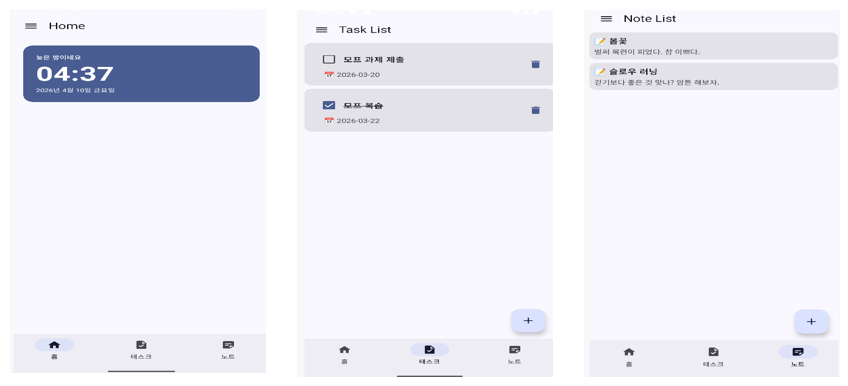

# 📑 07주차: Scaffold 

이번주 수업은 **앱 화면의 프레임**에 익숙해 지는 것이 목표입니다. 

---

## 1. 수업 목표
1. **Scaffold**의 역할과 구조를 이해.
2. **TopAppBar, BottomNavigationBar, FloatingActionButton, ModalNavigationDrawer, ModalBottomSheet** 사용법.
3. **Navigation과 Scaffold**를 함께 사용하는 구조 이해
4. **코루틴(Coroutine) 과 SideEffect 개념** 이해

---

## 2. 실습 주제

기존에 만들어온 Smart Task&Notes 앱에 프레임 요소들을 추가하며 기능을 완성합니다.

1. **TopAppBar, BottomNavigationBar, FloatingActionButton, ModalNavigationDrawer, ModalBottomSheet**를 추가합니다.

---

